<p align="center">
  
</p>

<h1 align="center"> OVERRIDE - AI race strategy Copilot</h1>

<p align="center">
  <strong>An explainable strategy intelligence copilot that helps teams and fans understand the FIA 2026 hybrid energy management decisions through telemetry reasoning, regulation grounding, and counterfactual strategy review.</strong>
</p>

<p align="center">
  
  
  
  
  
</p>

<p align="center">
  <a href="https://override-video.patrickndille.com">▶ Product Video</a>
  &nbsp;·&nbsp;
    <a href="https://override.patrickndille.com"> Live Demo</a>
  &nbsp;·&nbsp;
  <a href="docs/03-architecture.md">Architecture</a>
  &nbsp;·&nbsp;
  <a href="docs/04-api.md">API</a>

</p>

---

## The problem we are solving

Formula 1's 2026 regulation cycle turns energy management from a background system into one of the central strategic problems of every lap. The MGU-H is removed, the MGU-K triples to 350 kW, power delivery shifts toward a roughly 50/50 combustion-electric split, DRS gives way to Override Mode, active aerodynamics changes straight-line and cornering behavior, and sustainable fuel changes how the power unit behaves under load.

For engineers and analysts, that means each lap now carries a sequence of harvest, deploy, recharge, and Override tradeoffs. For broadcasters and fans, the deciding moments become harder to see: energy-budget decisions are often invisible on broadcast but measurable in telemetry. Existing public racing AI tools were shaped around the 2014–2025 hybrid era, so they do not directly provide an open, explainable layer for the new 2026 energy-management problem.

OVERRIDE builds as the explainable race intelligence layer for 2026 FIA Formula 1 hybrid energy management strategy, by translating telemetry-backed energy decisions into clear reasoning, regulatory evidence, and actionable insight that engineers, analysts, broadcasters, and fans can trust.

## Our AI / Technical Approach

OVERRIDE ingests a TORCS lab capture, sample replay, or FastF1-style session export and converts it into lap-level energy features. Deterministic Python heuristics first highlight inefficient deploy, harvest, recharge, or Override zones, giving the system a reliable evidence layer before any model is asked to explain the result.

The AI layer then grounds each recommendation in the current regulation source: Docling parses the FIA 2026 technical regulation text, Granite Embedding retrieves the relevant regulation chunk, and IBM Granite 4 Instruct on watsonx.ai generates a structured causal explanation with evidence, confidence, and a dynamically rendered citation. Every output passes through Pass 1 deterministic validation before Pass 2 Granite Guardian BYOC scoring for energy-safety and regulation-consistency. Both validation results are shown to the user.

The same engine supports Engineer Mode, Fan Mode, counterfactual strategy review, and the live TORCS cockpit. Engineer Mode shows reasoning chains, citations, validator badges, and counterfactual strategy review. Fan Mode translates the same evidence into plain language. IBM Granite Time Series TTM-R2 can add a 5-lap state-of-charge forecast through an optional isolated service; when it is unavailable or the session is too short, OVERRIDE gracefully continues from observed telemetry with `forecast=None`. Langflow mirrors the production FastAPI pipeline as a visual orchestration and demo layer.

## Why our solution matters in the context of racing

Racing is not short on data. The harder problem is trust: engineers, drivers, broadcasters, and fans need to understand why a strategy recommendation makes sense, what evidence supports it, and which regulation text it is grounded in.

OVERRIDE makes energy-budget decisions that are invisible on broadcast but measurable in telemetry easier to understand. Engineers and analysts get an auditable debrief that highlights cause, consequence, recommendation, validation status, and regulation grounding. Broadcasters get evidence-backed explanations they can translate on air. Fans get the same strategy story without needing to decode every technical acronym. Drivers and coaches get cause-and-effect feedback for building a new 2026 mental model.

The result is decision support, not replacement. OVERRIDE does not call the race or act for a team; it explains the tradeoffs, highlights the risk, and recommends options a human can review. That is the right shape of AI for a fast paced sport where trust, regulation, and explainability matter as much as speed.

## Strategy Decision Support

The 2026 hybrid reset makes race pace harder to interpret. Engineers and analysts can see telemetry, but the decisive question is whether the energy pattern supports the next racing objective: where did the car harvest too late, deploy into low-return moments, recharge without useful headroom, or leave Override value unused?

OVERRIDE is built for energy-budget decisions that are invisible on broadcast but measurable in telemetry. It turns a TORCS lab run, sample replay, or FastF1-style session export into an auditable strategy debrief that connects lap evidence to regulation-grounded reasoning.

The product is intentionally decision support. It highlights pressure, explains tradeoffs, validates model output, and recommends options a human can review.

## The Trust Layer

OVERRIDE uses a four-part proof frame:

**Detect -> Explain -> Validate -> Translate**

| Proof step | What OVERRIDE does | What the user sees | Core technology |
|---|---|---|---|
| **Detect** | Converts telemetry into lap-level energy features and highlights inefficient deploy, harvest, recharge, or Override zones. | Live cockpit pressure signals, energy curve, zone heatmap, session KPIs | Python, Pandas, deterministic heuristics |
| **Explain** | Generates a race-engineer explanation grounded in the current regulation source. | Cause, consequence, recommendation, reasoning chain, dynamic citation block | IBM Granite Instruct, Docling, Granite Embedding |
| **Validate** | Runs deterministic checks first, then AI safety scoring for energy-safety and regulation-consistency. | Pass-1 validator badge, Pass-2 Guardian score, low-confidence or rejection state when needed | Deterministic validator, IBM Granite Guardian BYOC |
| **Translate** | Renders the same evidence for technical and non-technical audiences. | Engineer Mode, Fan Mode, AI Race Engineer, counterfactual strategy review | IBM Granite Instruct, FastAPI, React |

Forecasting is an enhancement, not a dependency. IBM Granite Time Series TTM-R2 can add a 5-lap state-of-charge forecast through an optional isolated service. If the service is unavailable or the session is too short, OVERRIDE continues from observed telemetry with `forecast=None`.

## System Architecture

<p align="center"></p>


### Implementation

| Stage | Component | Technology |
|---|---|---|
| Ingest | `torcs_parser` / `fastf1_parser` | Python, Pandas |
| Aggregate | Lap-level energy features | Custom `analysis/` pipeline |
| Forecast | Optional 5-lap SoC trajectory | **IBM Granite Time Series TTM-R2** |
| Detect | Inefficient deploy / harvest / recharge / Override zones | Pure-Python heuristics |
| Ground | Dynamic regulation retrieval from parsed source text | **Docling** + **IBM Granite Embedding** |
| Explain | Causal reasoning chain | **IBM Granite Instruct** |
| Validate | Deterministic checks, then AI safety scoring | Validator + **IBM Granite Guardian BYOC** |
| Orchestrate | Visual pipeline mirror and demo canvas | **Langflow** |
| Translate | Engineer Mode, Fan Mode, and copilot responses | **IBM Granite Instruct** |

## Main Features

Screenshots of the UI can be found in the [assets/screenshots/](assets/screenshots) directory.

| Feature | Screenshot | Description |
|---|---|---|
| **Race Control / Live Capture** | [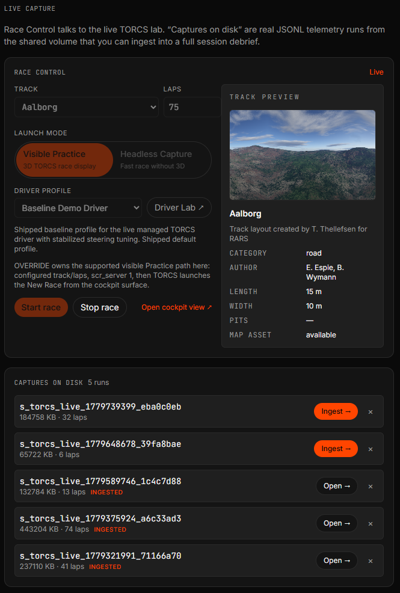](assets/screenshots/race-control.png) | The live TORCS lab can be launched from the UI, configured by track/lap/profile, and completed JSONL captures can be ingested into a full session debrief. |
| **Live Cockpit Simulation** | [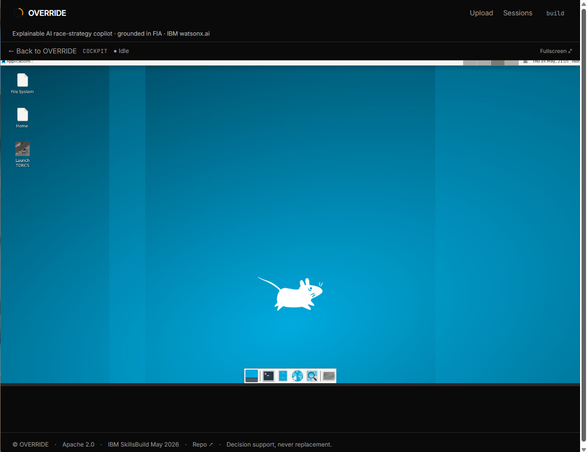](assets/screenshots/cockpit.png) | The live cockpit combines the TORCS frame, timing panel, lap timeline, SoC, harvest, deploy, and AI Race Engineer entry point in one race surface. |
| **Live Race Commentary** | [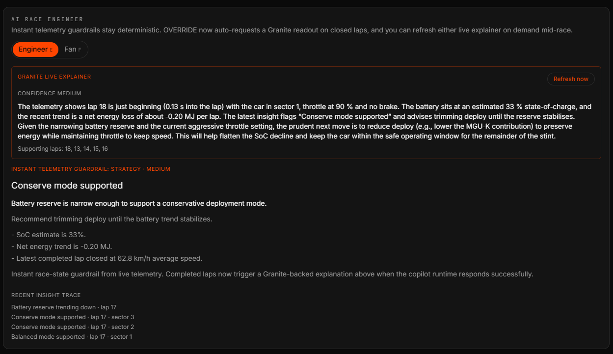](assets/screenshots/live-race-explainer.png) | Granite can generate a live race-engineer readout from recent closed laps while deterministic telemetry guardrails continue to highlight battery pressure. |
| **AI Race Assistant** | [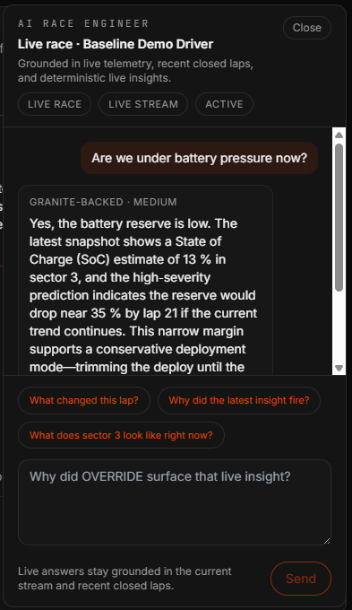](assets/screenshots/ai-race-assistant.png) | The assistant supports follow-up questions inside the current live race context, grounding responses in real-time stream state, recent lap insights, battery pressure estimates and reports artifacts. |
| **Energy Strategy Forecast** | [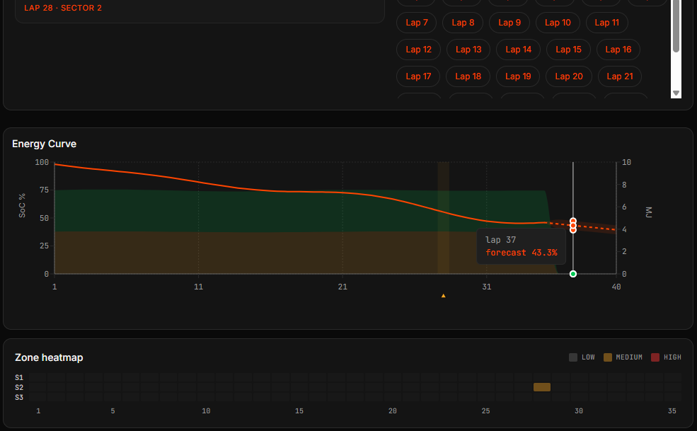](assets/screenshots/energy-forcast.png) | The energy curve shows observed SoC, forecast continuation, and detected zone evidence so strategy pressure is visible without reading raw telemetry. |
| **Post-Race Report and Analysis** | [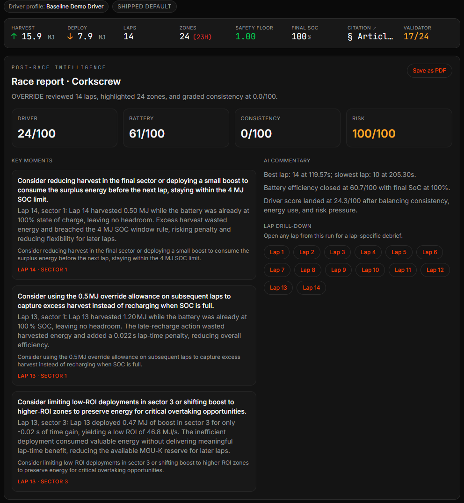](assets/screenshots/race-report.png) | A completed run becomes an executive debrief with driver, battery, consistency, and risk scores, plus key moments, AI commentary, lap drill-down, and PDF export. |
| **Engineer Reasoning/ Zone Card** | [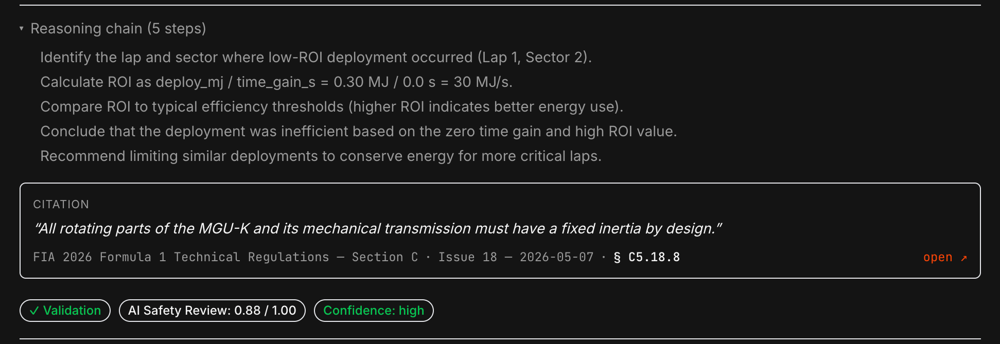](assets/screenshots/reasoning-card.png) | The recommendation card exposes cause, consequence, recommendation, reasoning chain, confidence, and dynamic regulation grounding. |
| **Counterfactual Strategy Review** | [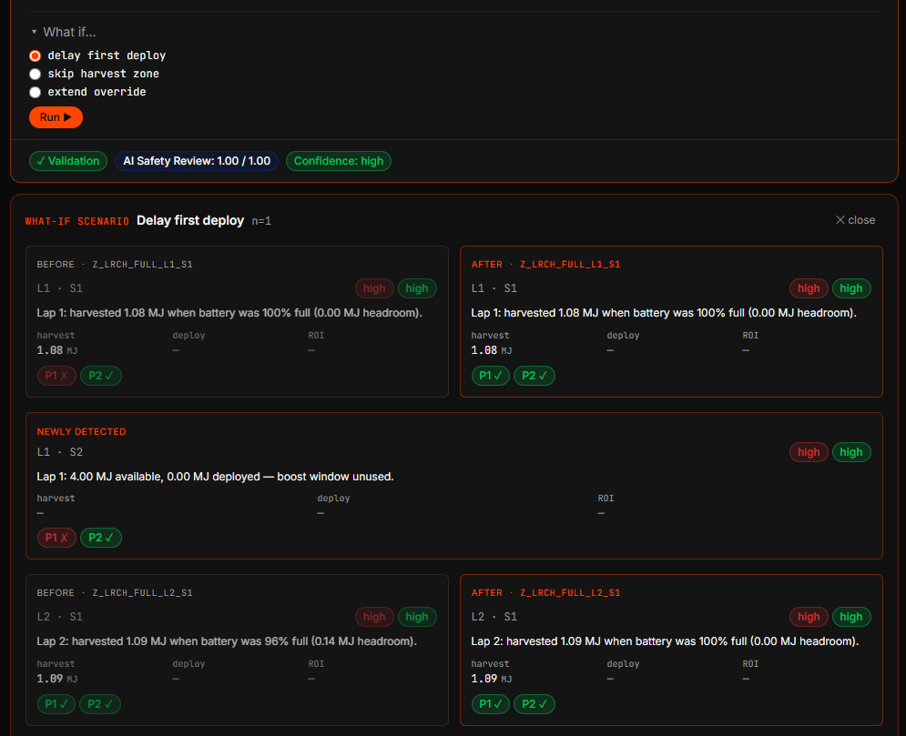](assets/screenshots/counter-factual.png) | Users can test alternate energy choices without bypassing safety gates using the same pipeline, showing before/after zone changes, newly detected pressure, and validation badges. |
| **Fan Mode** | [](assets/screenshots/fan-mode.png) | The same reviewed evidence is translated into plain language for broadcasters and fans without changing the underlying strategy record, why it mattered, and which rule shaped the recommendation. |
| **Layered Defense** | [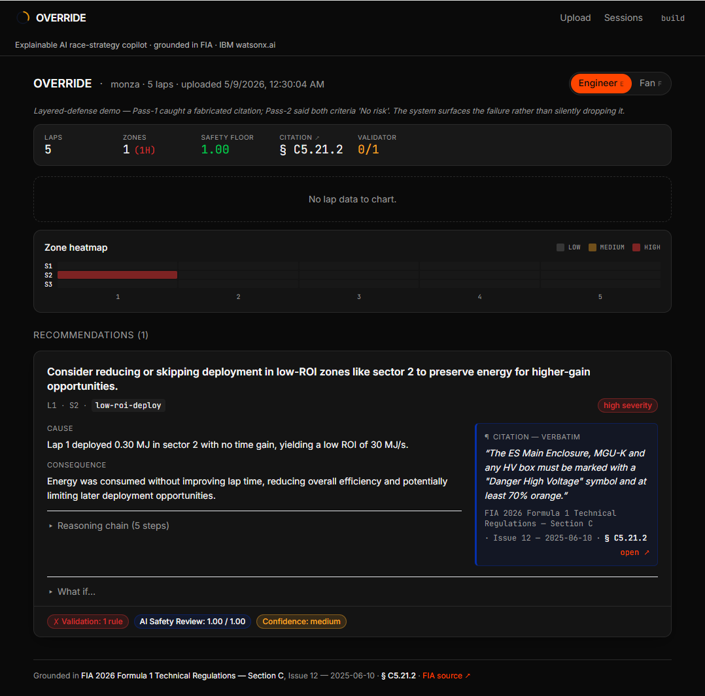](assets/screenshots/layered-defense.png) | Failure states are surfaced instead of hidden: the UI shows validator status, Guardian scoring, confidence, citation context, and the affected recommendation. |
| **Deterministic Validation** | [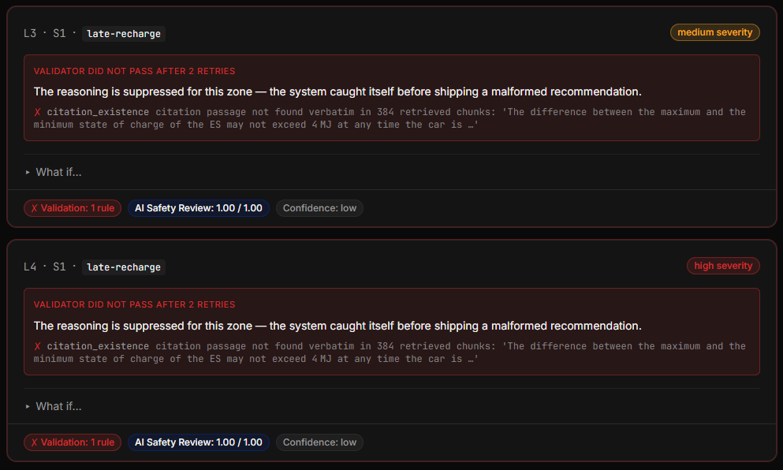](assets/screenshots/validation.png) | If deterministic validation still fails after retries, reasoning is suppressed for that zone and the failed rule is shown directly on the card. |
| **Driver Lab** | [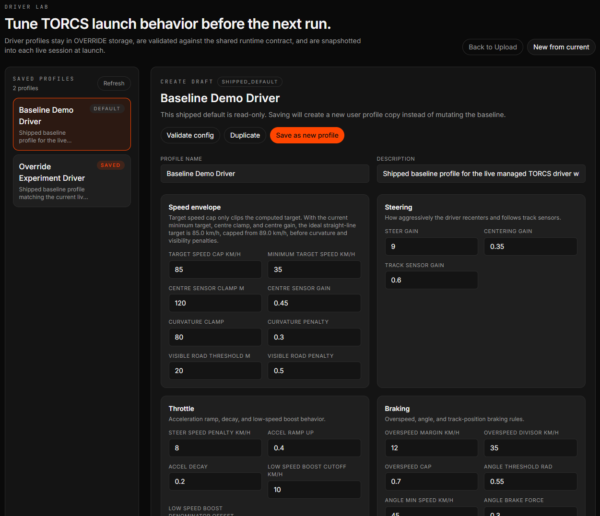](assets/screenshots/driver-lab.png) | TORCS driver profiles can be validated, duplicated, calibrated, saved, and snapshotted into the next live session without mutating the shipped TORCS baseline driver profile. |
| **Langflow Canvas** | [](assets/screenshots/langflow-canvas.png) | Langflow mirrors the production pipeline as a visual orchestration layer with the OVERRIDE components wired end to end. |
| **Jaeger Trace** | [](assets/screenshots/jaeger-trace.png) | OpenTelemetry spans show nested pipeline execution, including retrieval, reasoning, validation, Guardian scoring, and retry behavior. |

## IBM Technology

| Solution | How it is Used in OVERRIDE | Implementation Details |
|---|---|---|
| **1. Granite 4 Instruct** | Core reasoning engine + Fan Mode translation | watsonx.ai US-South, `ibm/granite-4-h-small`, generates causal reasoning chains and plain-language explanations |
| **2. Granite Guardian** | Pass-2 AI safety scoring (BYOC) | watsonx.ai US-South, `ibm/granite-guardian-3-8b`, scores recommendations on energy-safety and regulation-consistency |
| **3. Granite Embedding** | Regulation retrieval via semantic search | watsonx.ai US-South, `ibm/granite-embedding-278m-multilingual` (768-dim), enables cosine similarity + keyword scoring |
| **4. Granite Time Series TTM-R2** | 5-lap SoC forecasting (optional) | HuggingFace `ibm-granite/granite-timeseries-ttm-r2`, deployed as Docker service due to dependency isolation (ADR-004) |
| **5. Docling** | FIA regulation parsing and chunking | `pip install docling`, extracts 384 chunks from 2026 Technical Regulations Section C with PyPdfium backend |
| **6. Langflow** | Visual pipeline design + demo layer | `pip install langflow`, 9 custom components mirror production FastAPI pipeline for architecture demonstration |

**Additional Tools**:
- **IBM Bob** - Build-time development partner (acknowledgment only, not in runtime. Context settings [`.bob/`](.bob/), and instructions [`AGENTS.md`](AGENTS.md) )
- **IBM TORCS Learning Lab** - Foundation for live race integration and telemetry generation [`hands-on-labs/01_torcs_lab`](hands-on-labs/01_torcs_lab)
 
**Observability:** direct OpenTelemetry instrumentation covers FastAPI and the AI pipeline. The Jaeger proof appears in [Main Features](#main-features); enable with `OVERRIDE_TRACING=otlp` when capturing traces. Default is `off` (zero overhead).
 

 


## Try OVERRIDE

### Watch the product video

The 3-minute submission product demo video is available at:

> **[https://override-video.patrickndille.com](https://override-video.patrickndille.com)**


### Open the hosted review environment

While the review window is active, the browser demo is maintained at:

> **[https://override.patrickndille.com](https://override.patrickndille.com)**

Use the shipped demo fixtures on the upload page, or ingest an available TORCS capture, to review the Engineer Mode, Fan Mode, counterfactual strategy review, and AI Race Engineer surfaces. You can also upload a supported TORCS or FastF1-style replay export such as [`data/samples/laps.parquet`](data/samples/laps.parquet).

#### Bring Your Own Replay
1. Open the browser demo at **[https://override.patrickndille.com](https://override.patrickndille.com)**.
2. Click the upload area to select a file.
3. Select a supported TORCS or FastF1-style replay export, such as [`data/samples/laps.parquet`](data/samples/laps.parquet).

#### TORCS Lab Simulator
1. Open the browser demo at **[https://override.patrickndille.com](https://override.patrickndille.com)**.
2. In Race Control, select a track and click **Start Race**.
3. Wait for the simulator to launch and the cockpit to open.
4. Verify the timing state, hybrid rail, and AI Race Engineer panel are visible.
5. Watch the race for 2-3 laps, then ask the AI Race Engineer a question about the live run.
6. Stop the race by clicking **Stop Race**.
7. Return to Upload and ingest the TORCS capture.

### Run locally

```bash
git clone https://github.com/broadcomms/override-may-2026.git
cd override-may-2026
cp .env.example .env
# Fill WATSONX_API_KEY, WATSONX_PROJECT_ID, and WATSONX_URL.
podman-compose up
```
Open `http://localhost:8000` in your browser. Then use any of the shipped demo fixtures or upload a supported TORCS or FastF1-style replay export such as [`data/samples/laps.parquet`](data/samples/laps.parquet).

For the full operator guide, TORCS profile, Jaeger tracing, Langflow canvas, TTM-R2 service, and local development setup, see [`docs/07-deployment.md`](docs/07-deployment.md).

## Sample data

`data/sessions/sample_torcs.json` ships with a 5-lap synthetic replay that fires the `low-roi-deploy` zone detector reliably - drop it into the upload field for an end-to-end demo. No live data, no broadcast video, no proprietary feeds. Reproducible from public sources.

`data/samples/` ships with two real TORCS-lab captures emitted by the bundled telemetry logger:

| File | Source | Story |
|---|---|---|
| `torcs_baseline.jsonl` (~5.4 MB) | Lab Task 1 - defaults (`TARGET_SPEED=100`) | In-budget reference run; median harvest ≈ 3.8 MJ/lap, all laps under the 8.5 MJ cap |
| `torcs_modified.jsonl` (~6.7 MB) | Lab Task 3 - aggressive (`TARGET_SPEED=150`) | Over-cap demo; median harvest ≈ 9.3 MJ/lap, fires the `over-harvest` zone detector |

Both run through `ingest/torcs_parser.py` (calibrated against real captures - see the regression test in `tests/test_torcs_parser.py`). Drop either onto the upload page or - if running `podman-compose up override torcs` - drive the live lab in noVNC at `:6080` and the UI's "Live TORCS detected" banner surfaces fresh captures via `POST /api/sessions/torcs-live` for one-click ingest. `RaceYourCode/gym_torcs/*` is committed, so the live path works on a fresh clone with no manual unzip step.

`data/regs/` ships with the FIA 2026 Technical Regulations (Section C, Issue 18) and pre-built Docling-extracted chunks (`extracted_chunks.sample.json`, 384 chunks across 112 unique sections). The system parses the 8.5 MJ harvest cap directly from the regulation text - never hardcoded.

## Live performance (today, 2026-05-12)

End-to-end pipeline run on watsonx.ai Essentials, single zone, no retries:

| Stage | Latency | Notes |
|---|---|---|
| Ingest + Zone Detector | ~200 ms | local, deterministic (TORCS or FastF1) |
| Reg Retriever (Granite Embedding) | ~2.5 s | watsonx round-trip + cosine + keyword score |
| Reasoning (Granite 4-h-small Instruct) | ~4.0 s | 5-step chain + verbatim citation |
| Validator (Pass-1, deterministic) | <10 ms | 5 rule classes, no LLM |
| Guardian (Pass-2, Granite Guardian 3-8b) | ~1.5 s | 2 BYOC criteria scored in parallel |
| Fan-mode translation (lazy) | ~3.2 s | per-zone, on-demand, cached after first request |
| Counterfactual strategy review | ~6–8 s | reuses reasoning + Guardian path on perturbed laps; sha256-keyed disk cache for repeat scenarios |
| Live TORCS ingest (`POST /api/sessions/torcs-live`) | ~9 s | reads the shared `torcs-telemetry` volume, parses JSONL, pipes through `run_pipeline()` |
| Total (engineer happy path) | **~8.2 s** | first-try pass; with one counterfactual review, ~14–16 s end-to-end |

Test inventory currently stands at **439 collected tests**, including **4** network-marked watsonx integration tests. The frontend production build passes via `npm --prefix ui run build`. The container image remains multi-stage Node-20-alpine → Python-3.12-slim, and the 10 GB TORCS lab image is still profile-gated so it does not ship by default in the simplest app-only run.

## Design decisions

- **Upload-first, not live.** Live trackside inference would require licensed F1 data we don't have. Replay-first makes the system deterministic, demoable, and honest about what it is: a *strategy exploration tool*, not a production race-control system.
- **Lap-aggregated forecasting.** TTM-R2's open-source release is documented for minutely-to-hourly resolution. By aggregating to one row per lap (~90 seconds), we operate well within its scope and avoid the temptation to overclaim 3.7 Hz capability.
- **Graceful degradation.** The pipeline runs end-to-end without TTM. TTM enhances; it doesn't gate. Sessions with too few laps simply skip the forecast; reasoning continues from observed evidence.
- **Two-pass safety.** Pass 1 gives deterministic evidence checks before Pass 2 adds Granite Guardian semantic scoring. Both pass results are visible, so users can audit the recommendation rather than trust a black box.
- **Regulation grounding > telemetry brilliance.** Most racing-AI projects compete on "more data, faster models." OVERRIDE competes on *can it explain why*. Granite reasons over telemetry evidence and cites the verified regulation.
- **Decision support, not replacement.** Per the IBM SkillsBuild Challenge guidance, OVERRIDE is a copilot. The engineer (or curious fan) is always the decision-maker. The AI shows reasoning, cites regulations, and surfaces tradeoffs - it never *acts*.
- **Langflow is the design + demo layer.** Production runtime is FastAPI for performance and reliability. Langflow visually documents and demonstrates the architecture; it does not gate the production code path.


## Boundaries

- OVERRIDE is replay-first and simulator-grounded. It uses TORCS lab captures, synthetic TORCS-shaped fixtures, and FastF1-style replays, not proprietary team telemetry.
- Regulation grounding is dynamic through Docling-extracted source text. New FIA regulation issues require re-ingesting the source document rather than hardcoding article numbers.
- Fan Mode is a plain-language translation layer over the same reviewed evidence; it is not a substitute for professional commentary or FIA interpretation.
- OVERRIDE is decision support. It highlights, explains, validates, and recommends; a human remains responsible for race decisions.

## Forecasting

IBM Granite Time Series TTM-R2 can add a 5-lap state-of-charge forecast through an isolated service. Forecasting is optional: if the service is unavailable or the session has fewer than 30 completed laps, OVERRIDE continues from observed telemetry with `forecast=None`.

See [`docs/adrs/ADR-004-ttm-deployment.md`](./docs/adrs/ADR-004-ttm-deployment.md) for the service architecture.


## What this is not

- **Not a live pit-wall system.** No real-time team feed to intergate.
- **Not an autonomous strategist.** Every output is reviewed by a human.
- **Not an FIA-authoritative tool.** Reg interpretations are model-grounded; final reading lies with the FIA.
- **Not affiliated with Formula 1, the FIA, or any team.** Open-source **educational/research project**.

## Acknowledgements

Built for the IBM SkillsBuild AI Builders Challenge, May 2026, organized by BeMyApp. Development accelerated using IBM Bob. Foundation laid by the IBM TORCS Learning Lab. Grounded in IBM Granite 4.x Instruct, Granite Guardian (latest), Granite Embedding 278M Multilingual, Granite Time Series TTM-R2 (optional Docker service), Docling, and Langflow.

`RaceYourCode/gym_torcs/*` derives from [Gym-TORCS](https://github.com/ugo-nama-kun/gym_torcs) (MIT-licensed, © 2016 Naoto Yoshida), bundled here via the IBM SkillsBuild `hands-on-labs/01_torcs_lab/04_files/gym_torcs.zip` distribution. Original LICENSE preserved at `RaceYourCode/gym_torcs/LICENSE`.

## License

Apache 2.0 - See [LICENSE](LICENSE).
