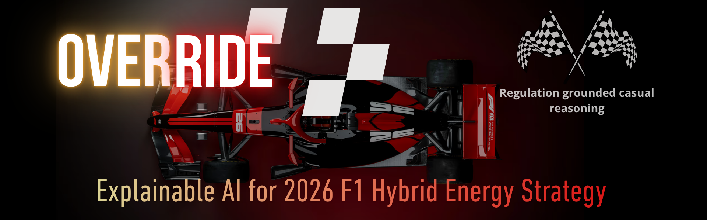
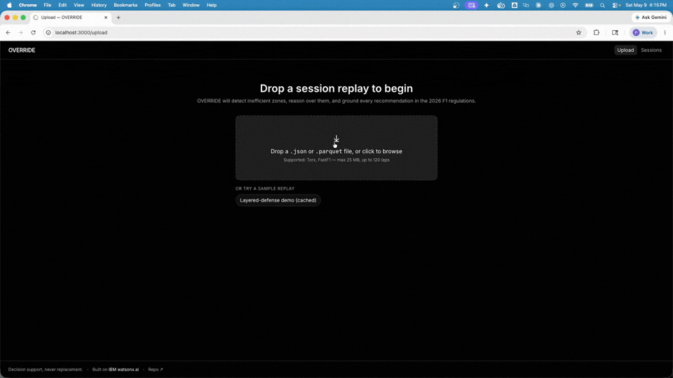
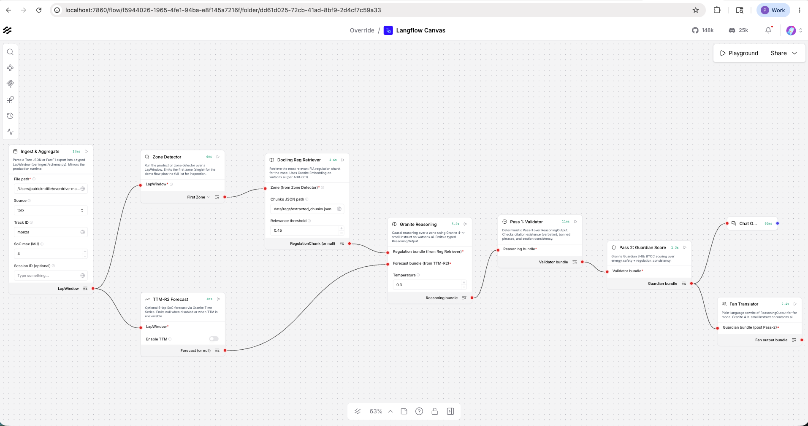
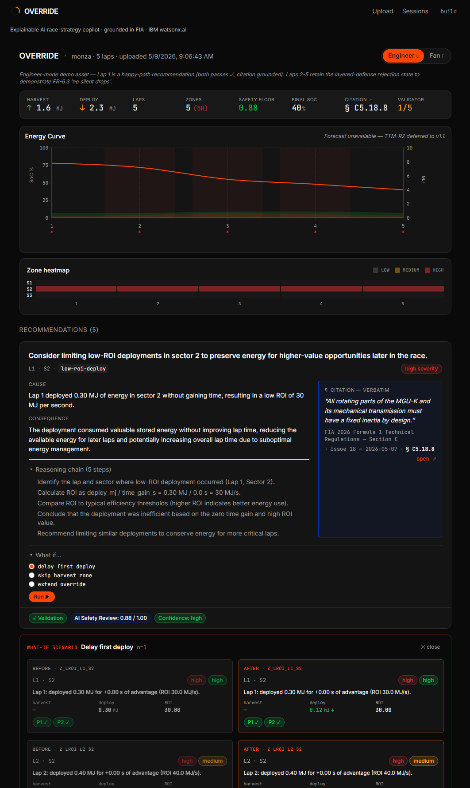
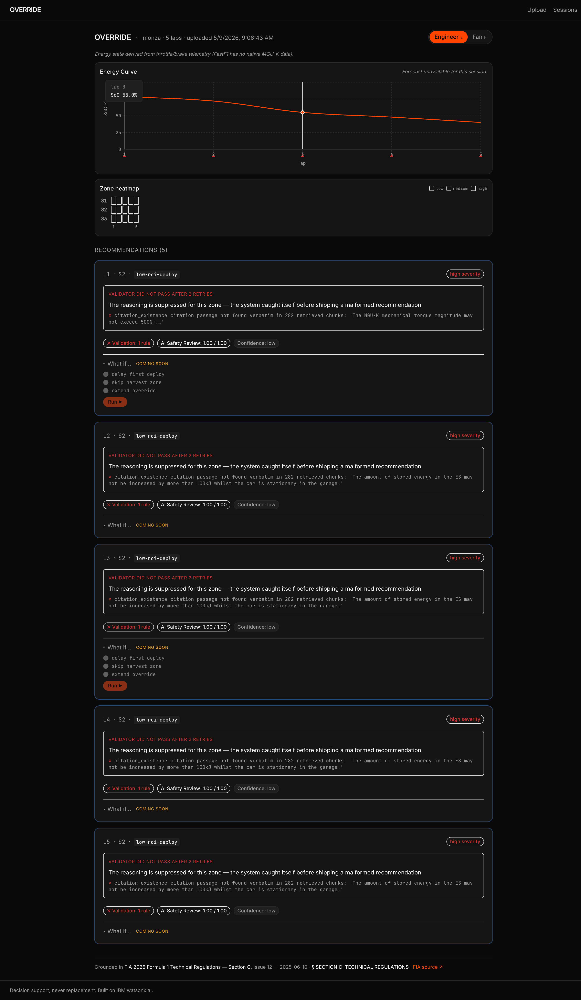
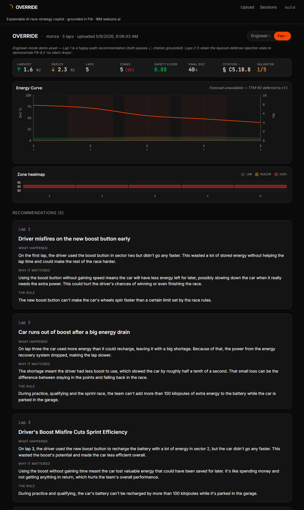
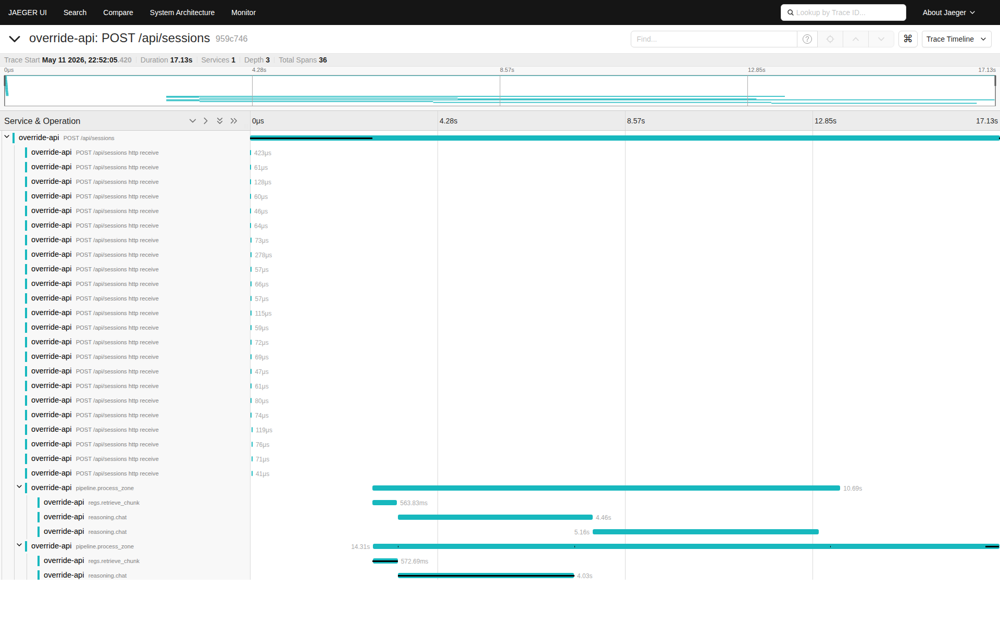
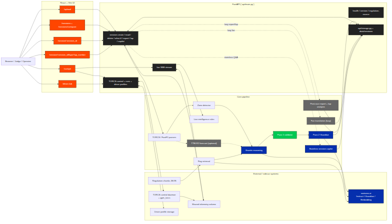

<p align="center">
  
</p>

<h1 align="center"> OVERRIDE</h1>

<p align="center">
  <strong>An explainable AI race-strategy copilot that helps teams and fans understand 2026 hybrid energy decisions through telemetry reasoning, regulation grounding, and what-if analysis.</strong>
</p>

<p align="center">
  
  
  
  
  
</p>

<p align="center">
  <a href="https://youtu.be/PENDING">▶️ 3-minute demo video</a>
  &nbsp;·&nbsp;
  <a href="docs/03-architecture.md">Architecture</a>
  &nbsp;·&nbsp;
  <a href="docs/04-ui-ux-design.md">UI/UX</a>
  &nbsp;·&nbsp;
  <a href="docs/04-api.md">API</a>
</p>

<!-- Demo loop GIF lands here once captured at end of P3.5 polish.
     <p align="center"></p>
-->

---

## What it looks like

<table>
<tr >
<td width="50%" valign=top>
<strong>Override demo loop</strong><br/>

<br/><br/><br/>
<strong>Langflow canvas demo layer</strong><br/>
<br/><br/>

<a href="docs/user/documentation.md">📖 Manual Test Plan</a>

</td>


<td width="50%" valign="top">

<strong>Engineer mode with citation</strong><br/>


</td>
</tr>
<tr>
<td><strong>Layered defense - system catches itself</strong><br/></td>
<td>
<strong>Fan mode - same intelligence, plain language</strong><br/>

</td>
</tr>
<tr>
<td colspan="2"><strong>Jaeger trace — full nested-span pipeline visibility</strong><br/><br/><em>Captured with <code>OVERRIDE_TRACING=otlp</code> against a local Jaeger all-in-one; pipeline stages render as nested children of the root request span, not as a flat list. The retry pattern (reasoning.chat fires 2–3 times per zone) shows the Pass-1 → Pass-2 retry budget in action.</em></td>
</tr>
</table>

---

## Why now

In 2026, Formula 1 enters the most disruptive technical regulation cycle in a decade. The MGU-H is gone. The MGU-K triples in power to 350 kW. The split between thermal and electric energy moves to roughly 50/50. DRS is replaced by Override Mode, deployed dynamically when a chasing car is within one second of the car ahead. Active aerodynamics introduces Z-Mode and X-Mode. Sustainable fuel changes engine behavior under load.

For race engineers and drivers, this means *every lap is now an energy management decision* — when to harvest, when to deploy, when to recharge, when to trigger Override. For fans, it means broadcasts become harder to follow: tactics that previously read as "they're just driving fast" now hide entire chess matches in the energy budget.

The publicly-shipped AI in this space — AWS F1 Insights, Oracle's Red Bull strategy stack, IBM's own Ferrari fan app — was built for the 2014–2025 hybrid rules. **There is no public, explainable tool for the 2026 era.**

OVERRIDE is the open-source answer: a copilot that takes a session replay, identifies inefficient deployment zones, forecasts the next five laps' state-of-charge trajectory, explains its reasoning in plain language grounded in the 2026 F1 energy-management regulations, and offers a what-if mode for testing alternative strategies.

## What it does

- **Engineer Mode** — full reasoning chains, regulation citations, confidence scores, what-if simulation.
- **Fan Mode** — same intelligence, plain language, no acronyms. *"The car used battery power too aggressively in low-return corners, leaving less energy available for the long straight."*
- **Upload-first.** Drop in a TORCS lab session, a FastF1 export, or a 2026 race replay. Get a debrief in under 30 seconds.
- **Regulation-grounded.** Every recommendation cites the relevant clause from the 2026 F1 energy-management regulations, parsed with Docling and rendered dynamically — never hardcoded.
- **Explainable.** Granite Guardian scores every recommendation on energy-safety and regulation-consistency dimensions before it's shown to the user.

## How it works

<p align="center"></p>

| Stage | Component | Tech |
|---|---|---|
| Ingest | `torcs_parser` / `fastf1_parser` | Python, Pandas |
| Aggregate | Lap-level energy features | Custom (see `analysis/`) |
| Forecast | 5-lap SoC trajectory | **IBM Granite Time Series TTM-R2** |
| Detect | Inefficient deploy / harvest / recharge zones | Pure-Python heuristics |
| Reason | Causal reasoning chain | **IBM Granite 4.x Instruct** |
| Ground | 2026 reg article retrieval | **Docling** |
| Score | Energy-safety + regulation-consistency | **IBM Granite Guardian (latest) BYOC** |
| Orchestrate | Visual pipeline | **Langflow** |
| Translate | Engineer → Fan Mode | **IBM Granite 4.x Instruct** |


## Technology Stack
 


| Component | Role | Source — verify Day 1 |
|---|---|---|
| Granite 4 Hybrid Small | Core reasoning + Fan Mode translation | watsonx.ai US-South, `ibm/granite-4-h-small`. Credentials in `.env` |
| Granite Guardian 3-8b | Pass 2 AI-based safety + regulation-consistency scoring (BYOC) | watsonx.ai US-South, `ibm/granite-guardian-3-8b` |
| Granite Time Series TTM-R2 | **Optional** lap-aggregated SoC/harvest/deploy forecasting | HuggingFace `ibm-granite/granite-timeseries-ttm-r2` |
| Docling | Parse FIA energy-management regulation, extract relevant section | `pip install docling` |
| Langflow | **Design + demo layer**, mirrors the production pipeline | `pip install langflow` |
| IBM Bob | **Build-time only** — development partner, README acknowledgment | bob.ibm.com/trial |
 
**Observability:** direct OpenTelemetry instrumentation (FastAPI auto-instrumentor + manual spans across reasoning / guardian / regs / pipeline stages). Toggle with `OVERRIDE_TRACING=otlp` and view in Jaeger — full nested span tree captured in `assets/screenshots/jaeger-trace.png` (36 spans / two `pipeline.process_zone` parents per request, each with `regs.retrieve_chunk` + `reasoning.chat` retry children). Default is `off` (zero overhead).
 

 


## Quickstart

### Hosted demo (May 27 – May 31, 2026)

If the judging window is live, the full Engineer + Fan + What-if flow is reachable in a browser at:

> **[https://override.patrickndille.com](https://override.patrickndille.com)**

Drop `data/sessions/sample_torcs.json` or click any of the three "OR TRY A SAMPLE REPLAY" pills on the upload page. End-to-end watsonx pipeline (~8 s).

The hosted URL is **ephemeral** — fronted by a Cloudflare Tunnel from a local WSL host, single-purpose for the IBM SkillsBuild AI Builders Challenge judging window. Routes are revoked post-May-31. The local-clone path below is the canonical reproduction; the hosted URL is convenience for judges who don't want to install Podman just to look. See [`docs/07-deployment.md`](./docs/07-deployment.md) for the full deployment posture (TLS, Cloudflare Access gating on admin surfaces, tear-down).

If the URL is offline, fall through to the local-clone path below — the demo is identical.

### Run with podman-compose (recommended)

Prerequisite: [install Podman](https://podman.io/docs/installation) and the separate [`podman-compose`](https://github.com/containers/podman-compose) package before using this path.

The shipping shape. One image, explicit service selection, and copy/paste commands that match the path verified in this repo environment.

```bash
git clone https://github.com/broadcomms/override-may-2026.git && cd override-may-2026
cp .env.example .env       # then fill WATSONX_API_KEY + WATSONX_PROJECT_ID

# Prerequisite: install the `podman-compose` package, this install podman dependencies.
# debian linux: WSL 2.0+ (Ubuntu 24.04)
apt-get update && apt-get install -y curl
apt install podman 
apt install podman-compose
podman --version
podman-compose --version                        # verify the package is installed
podman machine init                             # initialize the podman VM
podman machine start                            # start the podman VM


# Mode 1 — OVERRIDE alone (fast; default; fixture-driven demo path)
podman-compose up                                  # → UI + API at http://localhost:8000

# Mode 2 — OVERRIDE + live TORCS lab (drive in a browser; ~10 GB first pull, 10–15 min)
podman-compose up override torcs                   # adds noVNC at :6080, Ollama at :11434

# Mode 3 — OVERRIDE + Jaeger (for trace capture)
podman-compose up override jaeger                  # adds Jaeger UI at :16686

# Mode 4 — OVERRIDE + Langflow design canvas (visual mirror of the pipeline)
podman-compose up override langflow                # adds Langflow at :7860

# Full stack — OVERRIDE + TORCS + Jaeger + Langflow
podman-compose up override torcs jaeger langflow
```

The image is multi-stage (Node 20 alpine → Python 3.12 slim) and serves both the API and the built UI from `:8000`. Service selection is explicit: `podman-compose up torcs` starts only the TORCS lab, so include `override` whenever you want the app and an auxiliary service together. In this repo's tested WSL path, `podman-compose` is the supported operator contract; `podman compose` is environment-dependent and is not the default documented path here.

### Run locally (for hacking on the code)

```bash
# 1. Clone + Python 3.12 venv
git clone <repository-url>
cd overdrive-may-2026
python3.12 -m venv .venv
.venv/bin/pip install -r requirements.txt

# 2. Configure watsonx.ai credentials
cp .env.example .env
#   then edit .env to fill in WATSONX_API_KEY, WATSONX_PROJECT_ID, WATSONX_URL
.venv/bin/python scripts/test_watsonx.py    # gate G-1 (~5s)

# 3. Run the API
.venv/bin/uvicorn api.main:app --reload --port 3005

# 4. In a second terminal, run the UI
cd ui && npm install && npm run dev
# Open http://localhost:8000 → upload data/sessions/sample_torcs.json
```

Granite Instruct + Guardian + Embedding all run on watsonx.ai (US-South); only Docling chunk extraction runs locally. No 12 GB local model download. See [`docs/adrs/ADR-001-watsonx-runtime.md`](docs/adrs/ADR-001-watsonx-runtime.md) for the runtime split rationale.

### Optional: route chat to local Ollama (v1.1 preview)

The TORCS lab container ships `granite4:350m` via Ollama. Setting `OVERRIDE_LLM_RUNTIME=ollama` in `.env` routes OVERRIDE's reasoning + Fan Mode through the container's Ollama instead of watsonx (Guardian + Embedding stay on watsonx — see [`docs/adrs/ADR-003-llm-runtime-abstraction.md`](docs/adrs/ADR-003-llm-runtime-abstraction.md) for the hybrid posture). To use it without compose, install Ollama on the host:

```sh
curl -fsSL https://ollama.com/install.sh | sh
ollama pull granite4:350m
ollama run granite4:350m "Say hello in one short sentence."   # verify
# In .env: OVERRIDE_LLM_RUNTIME=ollama  OVERRIDE_OLLAMA_BASE_URL=http://localhost:11434
```

The 350 M model is meaningfully smaller than `granite-4-h-small`; reasoning quality drops accordingly. The all-Ollama path (Guardian + Embedding included) is v1.1 — see `docs/adrs/ADR-003-llm-runtime-abstraction.md`.

### Optional: Langflow design canvas

```bash
# Separate venv — Langflow ships its own packaging constraints
python3.12 -m venv .venv-langflow
.venv-langflow/bin/pip install -r requirements-langflow.txt

LANGFLOW_COMPONENTS_PATH="$(pwd)/langflow/override_components" \
PYTHONPATH="$(pwd):$PYTHONPATH" \
.venv-langflow/bin/langflow run
# Open http://localhost:7860 → import langflow/override.flow.json
```

The canvas mirrors the production pipeline as 9 visual nodes — useful for stepping through the architecture but not required to run OVERRIDE. See [`langflow/README.md`](langflow/README.md) for the full assembly walkthrough.

## Sample data

`data/sessions/sample_torcs.json` ships with a 5-lap synthetic replay that fires the `low-roi-deploy` zone detector reliably — drop it into the upload field for an end-to-end demo. No live data, no broadcast video, no proprietary feeds. Reproducible from public sources.

`data/samples/` ships with two real TORCS-lab captures emitted by the bundled telemetry logger:

| File | Source | Story |
|---|---|---|
| `torcs_baseline.jsonl` (~5.4 MB) | Lab Task 1 — defaults (`TARGET_SPEED=100`) | In-budget reference run; median harvest ≈ 3.8 MJ/lap, all laps under the 8.5 MJ cap |
| `torcs_modified.jsonl` (~6.7 MB) | Lab Task 3 — aggressive (`TARGET_SPEED=150`) | Over-cap demo; median harvest ≈ 9.3 MJ/lap, fires the `over-harvest` zone detector |

Both run through `ingest/torcs_parser.py` (calibrated against real captures — see the regression test in `tests/test_torcs_parser.py`). Drop either onto the upload page or — if running `podman-compose up override torcs` — drive the live lab in noVNC at `:6080` and the UI's "Live TORCS detected" banner surfaces fresh captures via `POST /api/sessions/torcs-live` for one-click ingest. `RaceYourCode/gym_torcs/*` is committed, so the live path works on a fresh clone with no manual unzip step.

`data/regs/` ships with the FIA 2026 Technical Regulations (Section C, Issue 18) and pre-built Docling-extracted chunks (`extracted_chunks.sample.json`, 384 chunks across 112 unique sections). The system parses the 8.5 MJ harvest cap directly from the regulation text — never hardcoded.

## Live performance (today, 2026-05-12)

End-to-end pipeline run on watsonx.ai Essentials, single zone, no retries:

| Stage | Latency | Notes |
|---|---|---|
| Ingest + Zone Detector | ~200 ms | local, deterministic (TORCS or FastF1) |
| Reg Retriever (Granite Embedding) | ~2.5 s | watsonx round-trip + cosine + keyword score |
| Reasoning (Granite 4-h-small Instruct) | ~4.0 s | 5-step chain + verbatim citation |
| Validator (Pass-1, deterministic) | <10 ms | 5 rule classes, no LLM |
| Guardian (Pass-2, Granite Guardian 3-8b) | ~1.5 s | 2 BYOC criteria scored in parallel |
| Fan-mode translation (lazy) | ~3.2 s | per-zone, on-demand, cached after first request |
| What-if perturbation re-run (FR-8) | ~6–8 s | reuses reasoning + Guardian path on perturbed laps; sha256-keyed disk cache for repeat scenarios |
| Live TORCS ingest (`POST /api/sessions/torcs-live`) | ~9 s | reads the shared `torcs-telemetry` volume, parses JSONL, pipes through `run_pipeline()` |
| Total (engineer happy path) | **~8.2 s** | first-try pass; with one what-if, ~14–16 s end-to-end |

Test inventory currently stands at **419 collected tests**, including **4** network-marked watsonx integration tests. The frontend production build passes via `npm --prefix ui run build`. The container image remains multi-stage Node-20-alpine → Python-3.12-slim, and the 10 GB TORCS lab image is still profile-gated so it does not ship by default in the simplest app-only run.

## Design decisions

- **Upload-first, not live.** Live trackside inference would require licensed F1 data we don't have. Replay-first makes the system deterministic, demoable, and honest about what it is: a *strategy exploration tool*, not a production race-control system.
- **Lap-aggregated forecasting.** TTM-R2's open-source release is documented for minutely-to-hourly resolution. By aggregating to one row per lap (~90 seconds), we operate well within its scope and avoid the temptation to overclaim 3.7 Hz capability.
- **Graceful degradation.** The pipeline runs end-to-end without TTM. TTM enhances; it doesn't gate. Sessions with too few laps simply skip the forecast; reasoning continues from observed evidence.
- **Two-pass safety.** Pass 1 (deterministic validation) protects the demo if Pass 2 (Granite Guardian) integration is rough. Both pass results are shown to the user — judges see a layered, defense-in-depth architecture.
- **Regulation grounding > telemetry brilliance.** Most racing-AI projects compete on "more data, faster models." OVERRIDE competes on *can it explain why*. Granite reasons over telemetry evidence and cites the verified regulation.
- **Decision support, not replacement.** Per the IBM SkillsBuild Challenge guidance, OVERRIDE is a copilot. The engineer (or curious fan) is always the decision-maker. The AI shows reasoning, cites regulations, and surfaces tradeoffs — it never *acts*.
- **Langflow is the design + demo layer.** Production runtime is FastAPI for performance and reliability. Langflow visually documents and demonstrates the architecture; it does not gate the production code path.


## Limitations

- Demo data uses real TORCS-lab captures, synthetic TORCS-shaped JSON, and FastF1 historical replays; this is not authoritative team telemetry. The TORCS energy model is derived from throttle/brake telemetry (TORCS has no native MGU-K state) — see [`docs/adrs/ADR-002-torcs-as-primary-sandbox.md`](docs/adrs/ADR-002-torcs-as-primary-sandbox.md).
- The 2026 regulations evolve via FIA-published Issues (currently grounded in Section C, Issue 18, dated 2026-05-07). Newer amendments require re-ingestion via `scripts/build_chunks.py`.
- Fan Mode uses an LLM for plain-language translation; it is Guardian-screened but is not a substitute for professional commentary.
- The Ollama runtime path (`OVERRIDE_LLM_RUNTIME=ollama`) covers chat only. Guardian (Pass-2 safety) and Embedding (regulation retrieval) still call watsonx — `WATSONX_API_KEY` remains required.

## What's coming next (v1.1)

Deferred from v1.0 for clean ship; documented here rather than half-implemented:

| Track | Status | Pointer |
|---|---|---|
| **TTM-R2 5-lap SoC forecasting** (FR-3) | Deferred — graceful-degradation guardrail makes it optional; energy curve renders an explicit "Forecast unavailable" badge | `core/forecasting.py` (stub), [`docs/06-roadmap.md`](docs/06-roadmap.md) |
| **Section B (Sporting Regulations) grounding** | PDF cached at `data/regs/`; not yet in the chunk corpus. Adds Override-Mode availability rules to `unused-override` zone citations (currently ships with `regulation_citation = null`) | [`docs/regulation-source.md`](docs/regulation-source.md) §"deliberately out of scope" |
| **Full Ollama-only mode** | Today: chat only via `granite4:350m`. Guardian + Embedding equivalents not in the shipped Ollama model — see ADR-003 for the migration path | [`docs/adrs/ADR-003-llm-runtime-abstraction.md`](docs/adrs/ADR-003-llm-runtime-abstraction.md) |
| **CI workflows** | Not in v1.0 scope. Quality gate today: `pytest -q -m "not network"` (340 green) + `npm run typecheck && npm run build` per the T-72h pre-flight in `docs/plans/final-lock-checklist.md` | `.github/workflows/` (empty placeholder removed in 3.1) |

## What this is not

- **Not a live pit-wall system.** No real-time team feed.
- **Not an autonomous strategist.** Every output is reviewed by a human.
- **Not an FIA-authoritative tool.** Reg interpretations are model-grounded; final reading lies with the FIA.
- **Not affiliated with Formula 1, the FIA, or any team.** Open-source educational/research project.

## Acknowledgements

Built for the IBM SkillsBuild AI Builders Challenge, May 2026, organized by BeMyApp. Development accelerated using IBM Bob. Foundation laid by the IBM TORCS Learning Lab. Grounded in IBM Granite 4.x Instruct, Granite Guardian (latest), Granite Embedding 278M Multilingual, Docling, and Langflow. (Granite Time Series TTM-R2 deferred to v1.1 per the graceful-degradation guardrail.)

`RaceYourCode/gym_torcs/*` derives from [Gym-TORCS](https://github.com/ugo-nama-kun/gym_torcs) (MIT-licensed, © 2016 Naoto Yoshida), bundled here via the IBM SkillsBuild `hands-on-labs/01_torcs_lab/04_files/gym_torcs.zip` distribution. Original LICENSE preserved at `RaceYourCode/gym_torcs/LICENSE`.

## License

Apache 2.0 — See [LICENSE](LICENSE).
