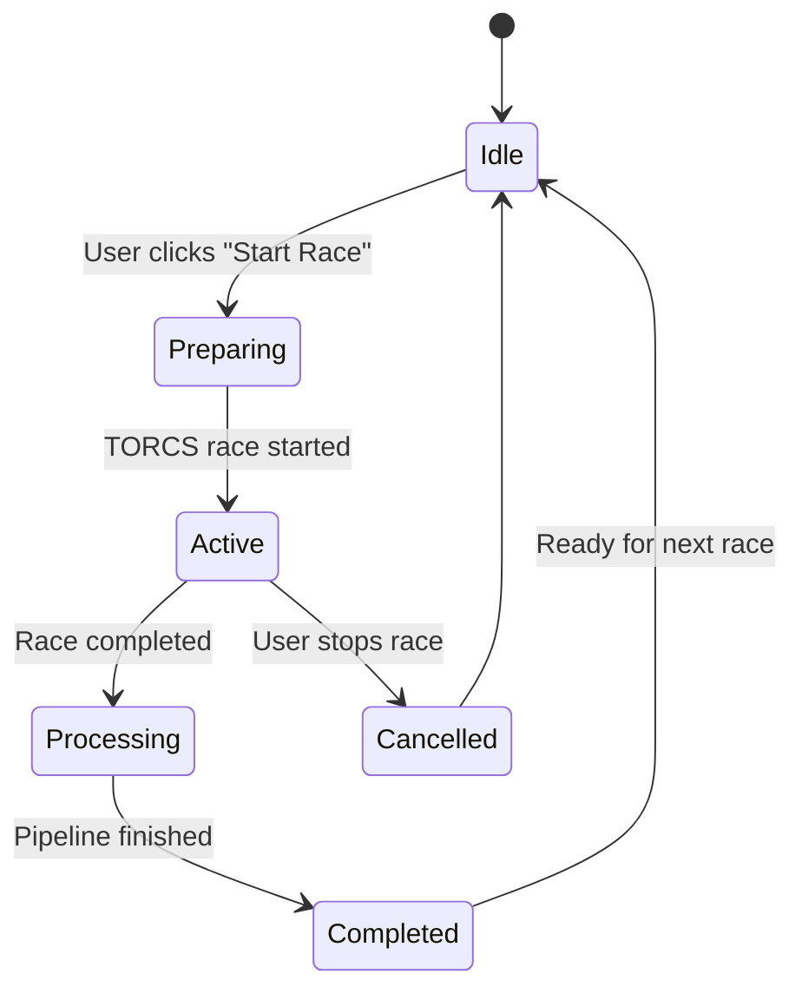

# Interactive TORCS Integration - Comprehensive Implementation Plan

**Status:** Planning  
**Created:** 2026-05-13  
**Priority:** High - Addresses critical UX gaps and session management issues

---

## Executive Summary

This plan addresses two critical gaps in the current OVERRIDE system:

1. **Session Management Issue:** Currently, all TORCS runs append to the same telemetry file, making it impossible to distinguish between different races or compare performance across sessions.

2. **User Experience Gap:** Users must manually open VNC clients, navigate TORCS menus, and run separate scripts to start races, creating friction and reducing the system's accessibility.

**Solution:** Integrate TORCS simulator directly into the OVERRIDE UI with embedded VNC display, interactive controls, and proper session lifecycle management.

---

## Current Architecture Analysis

### Strengths
- ✅ Docker compose already runs TORCS with VNC (ports 5900, 6080)
- ✅ noVNC web interface available at `localhost:6080/vnc.html`
- ✅ Telemetry logging via `torcs-telemetry` shared volume
- ✅ Session persistence well-structured in [`api/storage.py`](../../api/storage.py)
- ✅ Live ingest endpoint exists: `POST /api/sessions/torcs-live`
- ✅ `gym_torcs` driver in [`RaceYourCode/gym_torcs/`](../../RaceYourCode/gym_torcs/)

### Critical Gaps
- ❌ **No session boundaries:** All runs append to same file
- ❌ **No session lifecycle:** Can't distinguish race start/end
- ❌ **No session comparison:** Can't compare performance across races
- ❌ **Manual TORCS control:** Users must use VNC separately
- ❌ **No live telemetry streaming:** Must wait for race completion
- ❌ **No race metadata:** Track, duration, conditions not captured

---

## Three-Phase Implementation Plan

### Phase 1: Session Management Foundation (Critical)
**Goal:** Fix session lifecycle to enable proper race tracking and comparison

#### 1.1 Session Lifecycle State Machine



**States:**
- `idle`: No active race, ready to start new session
- `preparing`: Session created, waiting for TORCS to start
- `active`: Race in progress, telemetry streaming
- `processing`: Race ended, running AI pipeline
- `completed`: Session fully processed, results available
- `cancelled`: Race stopped before completion

#### 1.2 Enhanced Session Schema

**Extend [`ingest/schema.py`](../../ingest/schema.py):**

```python
class SessionStatus(str, Enum):
    IDLE = "idle"
    PREPARING = "preparing"
    ACTIVE = "active"
    PROCESSING = "processing"
    COMPLETED = "completed"
    CANCELLED = "cancelled"

class SessionMetadata(BaseModel):
    """Extended metadata for live TORCS sessions."""
    session_id: str
    status: SessionStatus
    created_at: datetime
    started_at: Optional[datetime] = None
    completed_at: Optional[datetime] = None
    track_name: Optional[str] = None
    target_laps: Optional[int] = None
    actual_laps: int = 0
    telemetry_file: Optional[str] = None  # Path to JSONL file
    notes: list[str] = Field(default_factory=list)

class SessionSummary(BaseModel):
    # ... existing fields ...
    metadata: Optional[SessionMetadata] = None  # For live sessions only
```

#### 1.3 Session Manager Service

**New file: [`api/session_manager.py`](../../api/session_manager.py)**

```python
class SessionManager:
    """Manages TORCS session lifecycle and telemetry routing."""
    
    def __init__(self, telemetry_dir: Path, sessions_dir: Path):
        self._telemetry_dir = telemetry_dir
        self._sessions_dir = sessions_dir
        self._active_session: Optional[SessionMetadata] = None
        self._lock = asyncio.Lock()
    
    async def start_session(
        self, 
        track: str, 
        laps: int,
        driver_config: dict
    ) -> SessionMetadata:
        """Create new session and prepare telemetry file."""
        async with self._lock:
            if self._active_session and self._active_session.status == "active":
                raise ValueError("Cannot start new session while race is active")
            
            session_id = _generate_session_id()
            telemetry_file = f"{session_id}_{int(time.time())}.jsonl"
            
            metadata = SessionMetadata(
                session_id=session_id,
                status="preparing",
                created_at=datetime.now(timezone.utc),
                track_name=track,
                target_laps=laps,
                telemetry_file=telemetry_file
            )
            
            self._active_session = metadata
            self._persist_metadata(metadata)
            return metadata
    
    async def mark_active(self, session_id: str) -> None:
        """Mark session as active when TORCS race starts."""
        # Update status, set started_at timestamp
        pass
    
    async def mark_completed(self, session_id: str) -> None:
        """Mark session as completed when race ends."""
        # Update status, set completed_at, trigger pipeline
        pass
    
    async def get_active_session(self) -> Optional[SessionMetadata]:
        """Get currently active session if any."""
        return self._active_session
    
    async def update_lap_count(self, session_id: str, lap: int) -> None:
        """Update actual lap count as race progresses."""
        pass
```

#### 1.4 Modified Telemetry Logger

**Update [`RaceYourCode/gym_torcs/torcs_jm_par.py`](../../RaceYourCode/gym_torcs/torcs_jm_par.py):**

```python
# Current: Writes to single file
# New: Read session_id from environment, write to session-specific file

def get_telemetry_path():
    """Get telemetry file path from session manager."""
    session_id = os.environ.get("OVERRIDE_SESSION_ID")
    if session_id:
        timestamp = int(time.time())
        return f"/home/student/workspace/gym_torcs/telemetry/{session_id}_{timestamp}.jsonl"
    else:
        # Fallback to legacy behavior
        return "/home/student/workspace/gym_torcs/telemetry/default.jsonl"
```

#### 1.5 API Endpoints for Session Management

**Add to [`api/main.py`](../../api/main.py):**

```python
@app.post("/api/sessions/start-race")
async def start_race(
    track: str = Form(...),
    laps: int = Form(default=10),
    driver_config: str = Form(default="{}"),
) -> SessionMetadata:
    """Start a new TORCS race session."""
    # 1. Create session via SessionManager
    # 2. Set OVERRIDE_SESSION_ID env for TORCS container
    # 3. Trigger gym_torcs driver script
    # 4. Return session metadata
    pass

@app.post("/api/sessions/{session_id}/stop")
async def stop_race(session_id: str) -> SessionMetadata:
    """Stop active race and mark session as cancelled."""
    pass

@app.get("/api/sessions/active")
async def get_active_session() -> Optional[SessionMetadata]:
    """Get currently active session if any."""
    pass

@app.get("/api/sessions/{session_id}/status")
async def get_session_status(session_id: str) -> SessionMetadata:
    """Get session status and metadata."""
    pass
```

#### 1.6 Session Comparison UI

**New component: [`ui/src/components/SessionComparison.tsx`](../../ui/src/components/SessionComparison.tsx)**

- Side-by-side session comparison
- Lap time deltas
- Energy deployment differences
- Zone detection comparison
- Recommendation differences

---

### Phase 2: Embedded VNC + Interactive Controls

**Goal:** Integrate TORCS simulator directly into UI with interactive controls

#### 2.1 VNC Integration Architecture

```
┌─────────────────────────────────────────────────────────────┐
│ OVERRIDE UI (React)                                         │
│                                                              │
│  ┌────────────────────────────────────────────────────────┐ │
│  │ SimulatorPanel Component                               │ │
│  │                                                         │ │
│  │  ┌──────────────────────┐  ┌─────────────────────────┐│ │
│  │  │ VNC Viewer           │  │ Control Panel           ││ │
│  │  │ (noVNC embedded)     │  │                         ││ │
│  │  │                      │  │ [Start Race]            ││ │
│  │  │  ┌────────────────┐  │  │ Track: [Dropdown]       ││ │
│  │  │  │ TORCS Display  │  │  │ Laps:  [Input]          ││ │
│  │  │  │                │  │  │ Driver: [Select]        ││ │
│  │  │  │  [Live Race]   │  │  │                         ││ │
│  │  │  │                │  │  │ [Stop Race]             ││ │
│  │  │  └────────────────┘  │  │                         ││ │
│  │  │                      │  │ Live Stats:             ││ │
│  │  │ WebSocket: ws://     │  │ • Lap: 5/10             ││ │
│  │  │ localhost:6080       │  │ • Speed: 245 km/h       ││ │
│  │  └──────────────────────┘  │ • SoC: 78%              ││ │
│  │                             │ • Deploy: 0.8 MJ        ││ │
│  │                             └─────────────────────────┘│ │
│  └────────────────────────────────────────────────────────┘ │
└─────────────────────────────────────────────────────────────┘
         │                                    │
         │ WebSocket (VNC)                   │ HTTP/WebSocket
         │                                    │ (Control + Telemetry)
         ▼                                    ▼
┌─────────────────────────────────────────────────────────────┐
│ Docker Compose Stack                                        │
│                                                              │
│  ┌──────────────────┐         ┌──────────────────────────┐ │
│  │ TORCS Container  │◄────────┤ OVERRIDE Container       │ │
│  │                  │         │                          │ │
│  │ • VNC: 6080      │         │ • API: 8000              │ │
│  │ • Xvfb Display   │         │ • SessionManager         │ │
│  │ • gym_torcs      │         │ • WebSocket Server       │ │
│  │ • Telemetry Log  │         │                          │ │
│  └──────────────────┘         └──────────────────────────┘ │
│         │                                │                  │
│         └────────────────────────────────┘                  │
│              torcs-telemetry volume                         │
└─────────────────────────────────────────────────────────────┘
```

#### 2.2 VNC Viewer Component

**New component: [`ui/src/components/VncViewer.tsx`](../../ui/src/components/VncViewer.tsx)**

```typescript
import { useEffect, useRef, useState } from 'react';
import RFB from '@novnc/novnc/core/rfb';

interface VncViewerProps {
  host?: string;
  port?: number;
  path?: string;
  onConnect?: () => void;
  onDisconnect?: () => void;
}

export function VncViewer({
  host = 'localhost',
  port = 6080,
  path = 'websockify',
  onConnect,
  onDisconnect
}: VncViewerProps) {
  const canvasRef = useRef<HTMLDivElement>(null);
  const rfbRef = useRef<RFB | null>(null);
  const [connected, setConnected] = useState(false);

  useEffect(() => {
    if (!canvasRef.current) return;

    const url = `ws://${host}:${port}/${path}`;
    const rfb = new RFB(canvasRef.current, url, {
      credentials: { password: '' }
    });

    rfb.addEventListener('connect', () => {
      setConnected(true);
      onConnect?.();
    });

    rfb.addEventListener('disconnect', () => {
      setConnected(false);
      onDisconnect?.();
    });

    rfb.scaleViewport = true;
    rfb.resizeSession = true;

    rfbRef.current = rfb;

    return () => {
      rfb.disconnect();
    };
  }, [host, port, path]);

  return (
    <div className="vnc-viewer">
      <div 
        ref={canvasRef} 
        className="vnc-canvas"
        style={{ width: '100%', height: '600px' }}
      />
      {!connected && (
        <div className="vnc-connecting">
          Connecting to TORCS simulator...
        </div>
      )}
    </div>
  );
}
```

#### 2.3 Simulator Control Panel

**New component: [`ui/src/components/SimulatorPanel.tsx`](../../ui/src/components/SimulatorPanel.tsx)**

```typescript
import { useState } from 'react';
import { VncViewer } from './VncViewer';
import { api } from '../api/client';

export function SimulatorPanel() {
  const [activeSession, setActiveSession] = useState<SessionMetadata | null>(null);
  const [track, setTrack] = useState('aalborg');
  const [laps, setLaps] = useState(10);
  const [liveStats, setLiveStats] = useState<LiveStats | null>(null);

  const handleStartRace = async () => {
    try {
      const session = await api.startRace({ track, laps });
      setActiveSession(session);
      // Start polling for live stats
      startLiveStatsPolling(session.session_id);
    } catch (error) {
      console.error('Failed to start race:', error);
    }
  };

  const handleStopRace = async () => {
    if (!activeSession) return;
    try {
      await api.stopRace(activeSession.session_id);
      setActiveSession(null);
      stopLiveStatsPolling();
    } catch (error) {
      console.error('Failed to stop race:', error);
    }
  };

  return (
    <div className="simulator-panel">
      <div className="simulator-display">
        <VncViewer 
          host="localhost"
          port={6080}
          onConnect={() => console.log('VNC connected')}
        />
      </div>
      
      <div className="control-panel">
        <h3>Race Controls</h3>
        
        {!activeSession ? (
          <div className="race-setup">
            <label>
              Track:
              <select value={track} onChange={e => setTrack(e.target.value)}>
                <option value="aalborg">Aalborg</option>
                <option value="alpine-1">Alpine 1</option>
                <option value="cg-track-2">CG Track 2</option>
              </select>
            </label>
            
            <label>
              Laps:
              <input 
                type="number" 
                value={laps} 
                onChange={e => setLaps(parseInt(e.target.value))}
                min={1}
                max={100}
              />
            </label>
            
            <button onClick={handleStartRace} className="btn-primary">
              Start Race
            </button>
          </div>
        ) : (
          <div className="race-active">
            <div className="session-info">
              <p>Session: {activeSession.session_id}</p>
              <p>Status: {activeSession.status}</p>
            </div>
            
            {liveStats && (
              <div className="live-stats">
                <h4>Live Telemetry</h4>
                <div className="stat">
                  <span>Lap:</span>
                  <span>{liveStats.current_lap} / {laps}</span>
                </div>
                <div className="stat">
                  <span>Speed:</span>
                  <span>{liveStats.speed_kmh.toFixed(1)} km/h</span>
                </div>
                <div className="stat">
                  <span>Battery SoC:</span>
                  <span>{(liveStats.soc * 100).toFixed(1)}%</span>
                </div>
                <div className="stat">
                  <span>Deploy (this lap):</span>
                  <span>{liveStats.deploy_mj.toFixed(2)} MJ</span>
                </div>
              </div>
            )}
            
            <button onClick={handleStopRace} className="btn-danger">
              Stop Race
            </button>
          </div>
        )}
      </div>
    </div>
  );
}
```

#### 2.4 TORCS Control API

**Add to [`api/main.py`](../../api/main.py):**

```python
@app.post("/api/torcs/start-race")
async def start_torcs_race(
    track: str = Form(...),
    laps: int = Form(default=10),
    driver: str = Form(default="scr_server 1"),
) -> dict:
    """Start TORCS race via docker exec."""
    # 1. Validate TORCS container is running
    # 2. Create session via SessionManager
    # 3. Set environment variables in TORCS container
    # 4. Execute gym_torcs driver script
    # 5. Return session metadata
    
    session = await session_manager.start_session(track, laps, {})
    
    # Execute in TORCS container
    cmd = [
        "podman", "exec", "-e", f"OVERRIDE_SESSION_ID={session.session_id}",
        "torcs", "python3", "/home/student/workspace/gym_torcs/torcs_jm_par.py",
        "--track", track, "--episodes", "1", "--steps", str(laps * 5000)
    ]
    
    # Run async subprocess
    process = await asyncio.create_subprocess_exec(*cmd)
    
    return {"session_id": session.session_id, "status": "started"}

@app.post("/api/torcs/stop-race")
async def stop_torcs_race() -> dict:
    """Stop active TORCS race."""
    # Send SIGTERM to gym_torcs process
    # Mark session as cancelled
    pass

@app.get("/api/torcs/tracks")
async def list_tracks() -> list[dict]:
    """List available TORCS tracks."""
    return [
        {"id": "aalborg", "name": "Aalborg", "length_km": 3.2},
        {"id": "alpine-1", "name": "Alpine 1", "length_km": 4.8},
        {"id": "cg-track-2", "name": "CG Track 2", "length_km": 5.1},
        # ... more tracks
    ]
```

---

### Phase 3: Live Race Analytics

**Goal:** Real-time telemetry streaming and live AI recommendations

#### 3.1 WebSocket vs Server-Sent Events Analysis

**Recommendation: Server-Sent Events (SSE)**

| Criterion | WebSocket | SSE | Winner |
|-----------|-----------|-----|--------|
| Complexity | High (bidirectional) | Low (unidirectional) | SSE |
| Browser Support | Excellent | Excellent | Tie |
| Reconnection | Manual | Automatic | SSE |
| Use Case Fit | Bidirectional chat | Server → Client stream | SSE |
| Overhead | Higher | Lower | SSE |
| FastAPI Support | Via starlette | Native | SSE |

**Decision:** Use SSE for telemetry streaming (server → client only). WebSocket not needed since client doesn't send telemetry back.

#### 3.2 Live Telemetry Streaming

**Add to [`api/main.py`](../../api/main.py):**

```python
from fastapi.responses import StreamingResponse
import asyncio

@app.get("/api/sessions/{session_id}/stream")
async def stream_telemetry(session_id: str):
    """Stream live telemetry via Server-Sent Events."""
    
    async def event_generator():
        telemetry_file = _get_telemetry_path(session_id)
        last_position = 0
        
        while True:
            # Check if session is still active
            session = await session_manager.get_session(session_id)
            if session.status in ["completed", "cancelled"]:
                yield f"data: {json.dumps({'event': 'session_ended'})}\n\n"
                break
            
            # Read new lines from telemetry file
            if telemetry_file.exists():
                with open(telemetry_file) as f:
                    f.seek(last_position)
                    new_lines = f.readlines()
                    last_position = f.tell()
                
                for line in new_lines:
                    try:
                        tick = json.loads(line)
                        # Send aggregated stats, not raw ticks
                        if tick.get('curLapTime', 0) % 1.0 < 0.02:  # ~1 Hz
                            stats = _aggregate_tick(tick)
                            yield f"data: {json.dumps(stats)}\n\n"
                    except json.JSONDecodeError:
                        continue
            
            await asyncio.sleep(0.1)  # 10 Hz polling
    
    return StreamingResponse(
        event_generator(),
        media_type="text/event-stream",
        headers={
            "Cache-Control": "no-cache",
            "X-Accel-Buffering": "no",
        }
    )

def _aggregate_tick(tick: dict) -> dict:
    """Convert raw TORCS tick to UI-friendly stats."""
    return {
        "timestamp": tick.get("t"),
        "lap": tick.get("lap", 0),
        "speed_kmh": tick.get("speedX", 0) * 3.6,
        "soc": _derive_soc(tick),  # From torcs_energy.py
        "deploy_mj": tick.get("deploy_mj", 0),
        "position": tick.get("distFromStart", 0),
    }
```

#### 3.3 Live Stats Component

**New component: [`ui/src/components/LiveStats.tsx`](../../ui/src/components/LiveStats.tsx)**

```typescript
import { useEffect, useState } from 'react';

interface LiveStatsProps {
  sessionId: string;
  onSessionEnd?: () => void;
}

export function LiveStats({ sessionId, onSessionEnd }: LiveStatsProps) {
  const [stats, setStats] = useState<TelemetryStats | null>(null);
  const [connected, setConnected] = useState(false);

  useEffect(() => {
    const eventSource = new EventSource(
      `/api/sessions/${sessionId}/stream`
    );

    eventSource.onopen = () => setConnected(true);
    
    eventSource.onmessage = (event) => {
      const data = JSON.parse(event.data);
      
      if (data.event === 'session_ended') {
        eventSource.close();
        onSessionEnd?.();
        return;
      }
      
      setStats(data);
    };

    eventSource.onerror = () => {
      setConnected(false);
      eventSource.close();
    };

    return () => eventSource.close();
  }, [sessionId]);

  if (!stats) {
    return <div>Waiting for telemetry...</div>;
  }

  return (
    <div className="live-stats">
      <div className="stat-card">
        <h4>Current Lap</h4>
        <div className="stat-value">{stats.lap}</div>
      </div>
      
      <div className="stat-card">
        <h4>Speed</h4>
        <div className="stat-value">{stats.speed_kmh.toFixed(1)} km/h</div>
      </div>
      
      <div className="stat-card">
        <h4>Battery SoC</h4>
        <div className="stat-value">{(stats.soc * 100).toFixed(1)}%</div>
        <div className="stat-bar">
          <div 
            className="stat-bar-fill"
            style={{ width: `${stats.soc * 100}%` }}
          />
        </div>
      </div>
      
      <div className="stat-card">
        <h4>Energy Deploy</h4>
        <div className="stat-value">{stats.deploy_mj.toFixed(2)} MJ</div>
      </div>
    </div>
  );
}
```

#### 3.4 Live Zone Detection

**Challenge:** Zone detection requires completed laps. Can't detect zones mid-race.

**Solution:** Show "potential zones" based on current lap patterns:

```python
@app.get("/api/sessions/{session_id}/live-zones")
async def get_live_zones(session_id: str) -> dict:
    """Get potential zones from incomplete session."""
    # Parse current telemetry
    # Run zone detector on completed laps only
    # Return zones with "preliminary" flag
    pass
```

#### 3.5 Live Recommendation Generation

**Option A: Wait for race completion** (Current behavior)
- Pros: Full context, accurate recommendations
- Cons: No live feedback during race

**Option B: Progressive recommendations** (New)
- Generate recommendations for completed laps
- Mark as "preliminary" until race ends
- Re-run full pipeline on completion

**Recommendation:** Option A for v1, Option B for future enhancement

---

## Implementation Roadmap

### Sprint 1: Session Management Foundation (Week 1-2)
- [ ] Extend session schema with lifecycle states
- [ ] Implement SessionManager service
- [ ] Add session lifecycle API endpoints
- [ ] Modify telemetry logger for session-specific files
- [ ] Add session status tracking
- [ ] Build session comparison UI component
- [ ] Write integration tests

**Deliverable:** Users can start/stop races with unique session IDs

### Sprint 2: VNC Integration (Week 3-4)
- [ ] Add noVNC dependency to UI
- [ ] Build VncViewer React component
- [ ] Create SimulatorPanel with embedded VNC
- [ ] Add TORCS control API endpoints
- [ ] Implement track selection
- [ ] Add race parameter configuration
- [ ] Test VNC connectivity and performance

**Deliverable:** Users can view and control TORCS from OVERRIDE UI

### Sprint 3: Live Telemetry Streaming (Week 5-6)
- [ ] Implement SSE telemetry streaming endpoint
- [ ] Build LiveStats React component
- [ ] Add real-time stat updates to SimulatorPanel
- [ ] Implement telemetry aggregation logic
- [ ] Add connection status indicators
- [ ] Handle reconnection scenarios
- [ ] Performance testing (latency, throughput)

**Deliverable:** Users see live race stats during active sessions

### Sprint 4: Polish & Integration (Week 7-8)
- [ ] Add error handling and edge cases
- [ ] Implement session history view
- [ ] Add session comparison features
- [ ] Write comprehensive documentation
- [ ] Create demo video
- [ ] Performance optimization
- [ ] Security review
- [ ] User acceptance testing

**Deliverable:** Production-ready interactive TORCS integration

---

## Technical Specifications

### Session ID Format
```
s_torcs_live_{timestamp}_{random}
Example: s_torcs_live_1715567890_a4f9
```

### Telemetry File Naming
```
{session_id}_{start_timestamp}.jsonl
Example: s_torcs_live_1715567890_a4f9_1715567895.jsonl
```

### API Endpoints Summary

| Method | Endpoint | Purpose |
|--------|----------|---------|
| POST | `/api/sessions/start-race` | Start new TORCS race |
| POST | `/api/sessions/{id}/stop` | Stop active race |
| GET | `/api/sessions/active` | Get active session |
| GET | `/api/sessions/{id}/status` | Get session status |
| GET | `/api/sessions/{id}/stream` | Stream live telemetry (SSE) |
| GET | `/api/torcs/tracks` | List available tracks |
| GET | `/api/sessions/history` | List past sessions |
| GET | `/api/sessions/compare?ids=...` | Compare sessions |

### Environment Variables

```bash
# TORCS container
OVERRIDE_SESSION_ID=s_torcs_live_1715567890_a4f9
OVERRIDE_LOG_TELEMETRY=1
OVERRIDE_TRACK=aalborg
OVERRIDE_LAPS=10

# OVERRIDE container
OVERRIDE_TELEMETRY_DIR=/app/data/telemetry
SESSIONS_DIR=/app/data/sessions
```

---

## Security Considerations

### TORCS Control Access
- **Risk:** Arbitrary command execution in TORCS container
- **Mitigation:** 
  - Whitelist allowed tracks
  - Validate all parameters
  - Rate limit race starts (max 1 per minute)
  - Add authentication layer (future)

### VNC Exposure
- **Risk:** Unauthorized VNC access
- **Mitigation:**
  - VNC only accessible via localhost
  - No external port exposure
  - Consider VNC password in production

### Resource Exhaustion
- **Risk:** Multiple concurrent races
- **Mitigation:**
  - Enforce single active session
  - Timeout inactive sessions (30 min)
  - Monitor TORCS container resources

---

## Testing Strategy

### Unit Tests
- SessionManager state transitions
- Telemetry file routing
- Session ID generation
- API parameter validation

### Integration Tests
- Full race lifecycle (start → active → complete)
- Telemetry streaming
- Session comparison
- VNC connectivity

### Performance Tests
- SSE latency (<100ms)
- Telemetry throughput (50 Hz)
- Concurrent session handling
- Memory usage during long races

### User Acceptance Tests
- Start race from UI
- View live simulator display
- Monitor real-time stats
- Stop race mid-session
- Compare two sessions
- Handle network interruptions

---

## Migration Path

### Backward Compatibility
- Existing sessions remain accessible
- Legacy telemetry files still parseable
- No breaking changes to current API

### Data Migration
- No migration needed (new feature)
- Existing sessions lack metadata (acceptable)
- Future sessions have full lifecycle tracking

---

## Success Metrics

### User Experience
- ✅ Users can start races without VNC client
- ✅ Live simulator display in UI
- ✅ Real-time race statistics
- ✅ Clear session boundaries
- ✅ Session comparison capability

### Technical
- ✅ <100ms SSE latency
- ✅ 50 Hz telemetry streaming
- ✅ Zero data loss during streaming
- ✅ Graceful handling of disconnections
- ✅ <5% CPU overhead for streaming

### Business
- ✅ Reduced user friction (no manual VNC)
- ✅ Better demo experience
- ✅ Enables session-based analytics
- ✅ Foundation for future features

---

## Future Enhancements (Post-v1)

### Multi-User Support
- Multiple concurrent sessions
- User authentication
- Session ownership

### Advanced Analytics
- Session clustering
- Performance trends
- Optimal strategy discovery

### AI Driver Training
- Reinforcement learning integration
- Strategy optimization
- Automated testing

### Cloud Deployment
- Remote TORCS instances
- Scalable session management
- Distributed telemetry processing

---

## References

- [noVNC Documentation](https://github.com/novnc/noVNC)
- [Server-Sent Events Spec](https://html.spec.whatwg.org/multipage/server-sent-events.html)
- [FastAPI WebSocket/SSE Guide](https://fastapi.tiangolo.com/advanced/websockets/)
- [TORCS Documentation](http://torcs.sourceforge.net/)
- Current Architecture: [`docs/03-architecture.md`](../03-architecture.md)
- Session Schema: [`docs/04-schema.md`](../04-schema.md)
- API Spec: [`docs/04-api.md`](../04-api.md)

---

## Approval & Next Steps

**Status:** Awaiting approval

**Questions for Review:**
1. Does the three-phase approach align with priorities?
2. Is the 8-week timeline acceptable?
3. Any concerns about SSE vs WebSocket decision?
4. Should we add authentication in Phase 1 or defer?
5. Any additional security requirements?

**After Approval:**
- Create feature branch: `feature/interactive-torcs`
- Set up project board with Sprint 1 tasks
- Begin implementation with Session Management Foundation